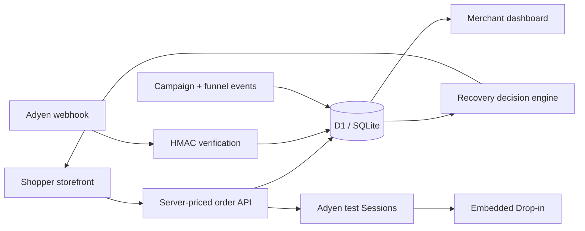

# PayRecover

PayRecover is a beginner-friendly FinTech + MarTech project for independent online merchants. It demonstrates how a checkout can preserve an order after a failed payment, recommend a safe retry, and measure recovered revenue.

**Live demo:** [payrecover-demo.kashvivelmurugan.chatgpt.site](https://payrecover-demo.kashvivelmurugan.chatgpt.site/)

## Current milestone — Phase 5 (complete)

- Merchant payment-health dashboard
- Persistent six-product demo storefront and quantity-based cart
- Server-priced order creation with customer and campaign context
- Persistent failed-card to UPI recovery journey
- Live dashboard aggregation from orders and payment attempts
- D1/SQLite migrations for products, orders, items, attempts, webhooks, and analytics
- Real Adyen test Sessions endpoint and embedded Web Drop-in
- HMAC-verified, duplicate-safe Adyen Standard webhook endpoint
- Webhook-authoritative order and attempt reconciliation
- Explainable recovery engine for five failure categories
- Safe retry eligibility, method, and timing decisions
- Risk-block protection that prevents automated retries
- Retry-success and failure-distribution analytics
- UTM campaign attribution from visit through paid order
- Persistent checkout-funnel events by shopper session
- Payment-method conversion reporting
- Deterministic A/B test for recovery-message conversion
- Simulator fallback when Adyen test credentials are not configured

All visible numbers are test data. Production payments are intentionally unsupported.

## Run locally

```bash
npm install
npm test
npm run dev
```

Open `http://localhost:3000`.

To demonstrate campaign attribution, open a URL such as `http://localhost:3000/?utm_campaign=summer_social`, complete a test order, and return to the merchant dashboard.

Copy `.env.example` to `.env.local` and add credentials from your Adyen test Customer Area to activate Drop-in. Register the Standard webhook URL as `/api/adyen/webhooks`, enable HMAC signing, and put its hexadecimal HMAC key in `ADYEN_HMAC_KEY`. Without these values, PayRecover stays in its fully working simulator mode.

## Architecture

The React/Vinext interface runs on Cloudflare Workers through Sites. Durable structured data uses D1. Catalog, order, payment, webhook, recommendation, and dashboard APIs run server-side. Only Adyen's public client key reaches the browser; API and HMAC secrets stay in server runtime variables.



## Business value

- Preserves the order when the first payment fails.
- Prevents unsafe retries for risk-blocked payments.
- Connects every retry to its original attempt.
- Separates provisional browser feedback from authoritative webhook status.
- Attributes paid and recovered revenue to marketing campaigns.
- Measures whether a recovery message changes shopper behavior.

## Portfolio talking points

1. **FinTech:** server-owned pricing, idempotent attempts, signed webhooks, provider reconciliation, and safe retry eligibility.
2. **MarTech:** UTM attribution, session funnels, method conversion, recovered revenue, and deterministic experimentation.
3. **Product judgment:** simulator fallback makes the full learning journey usable without secrets while the real Adyen test integration remains ready.
4. **Safety:** no raw payment credentials are stored, risk blocks cannot be automatically retried, and demo deletion requires explicit confirmation.

## Quality checks

`npm test` covers recovery classification, risk safeguards, event vocabulary, and stable experiment assignment. `npm run build` performs the production compilation. The deployed dashboard is private to its owner; this is the merchant-access boundary for the portfolio demo.

See `docs/PROJECT.md` for scope, rules, and the phased implementation plan.

## Security

PayRecover supports Adyen test mode and simulated outcomes; it must not process real money. Do not commit API keys, webhook secrets, payment credentials, or production customer data. Please read [SECURITY.md](SECURITY.md) before reporting a vulnerability.

## License

This project is available under the [MIT License](LICENSE). Copyright © 2026 KaviyaVelmurugan.
